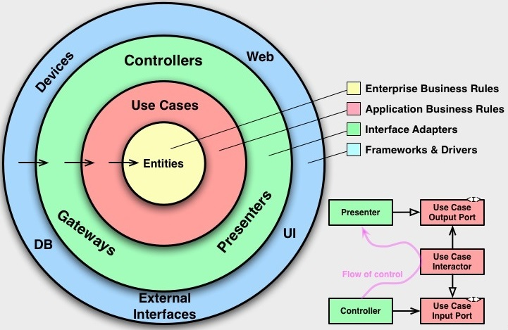

## Clean Architecture
 

**Domain Layer**

A camada de mais alto nível, responsável por amazenar os casos de uso e as entidades, basicamente as regras de negócios. Nesta camada não existem implementações concretas, apenas interfaces.

**Data Layer**

A camada de dados responável por implementar as classes concretas dos protocolos definidos em Domain Layer.
Nessa camada não a comunição direta com a domain layer, as comunições se dão apenas através de interfaces, tornando o código mais flexível para mudanças, mantendo o acoplamento mais baixo entre as duas camadas. Aqui serão definidos os protolos que serão implementados na camada de Infra Layer.

**Infra Layer**

A camada de infra layer ou infraestrutura é responsável por realizar a comunicação com serviços externos, através de bibliotecas de terceiros ou não, como por exemplo aqui podemos implentar classes concretas usando o Axios para request feitos para nossa API.

**Presentation Layer**

A camada presentation é responsável por nossa UI(User Interface) e tratamento de conversão de dados vindo, como por exemplo, a API. A prensentation layer depende da domain layer, porem o domain layer não depende de ninguém.

**Validation Layer**
A camada validation é responsável por todas as regras de validação utilizada na aplicação, como validar um email e campos obrigatórios, não usaremos libs de validação para não aclopar nosso projeto a essas libs.

**Main Layer**

A camada responsável por todo acoplamento da nossa aplicação, vamos dizer que a camada suja.